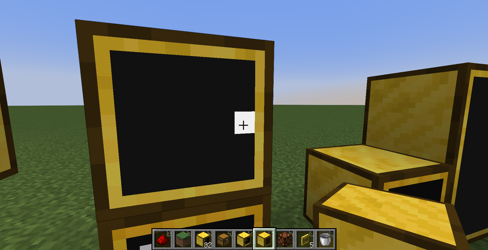
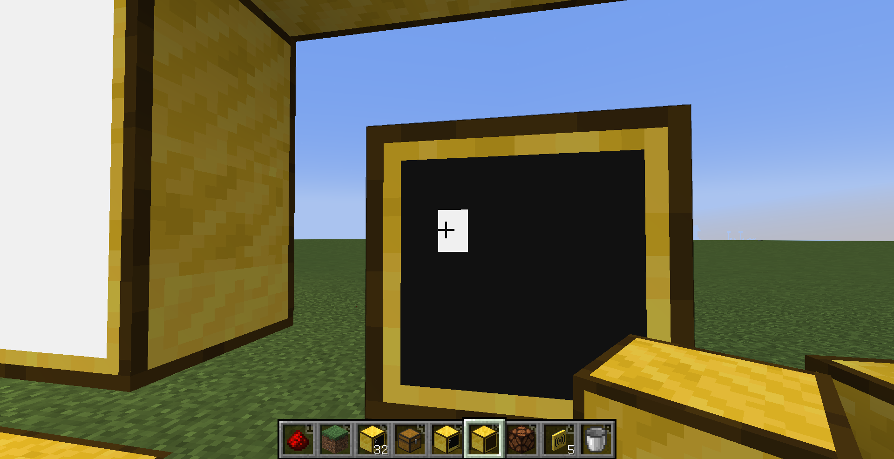

# Description

a crate which aims to control Computer Craft computers via websocket

# Example

server side rust code

```rust
use std::time::Duration;
use computercraft_websocket_control::{ColorId, Event, Ports, Side, ToErrorsResult};
fn main() {
    computercraft_websocket_control::serve_tick_func(&([127, 0, 0, 1], 14111).into(), tick, (0, 0, 1, 1));
}

async fn tick(
    state: &mut (u16, u16, u16, u16),
    mut ports: Ports<'_>,
    _dt: Duration,
) -> Result<(), websocket_control::Errors> {
    let (mut sizex, mut sizey, mut x, mut y) = *state;
    let mut p1 = ports.get_port("p1").to_errors_result()?;
    p1.monitor_write(Side::Top, x, y, ColorId::C05, ColorId::C01, ' ')
        .await?;
    if let Some(evt) = p1.pull_event().await? {
        match evt {
            Event::MonitorTouch {
                side: Side::Top,
                x: x1,
                y: y1,
            } => {
                if (x, y) == (x1, y1) {
                    (sizex, sizey) = p1.monitor_get_size(Side::Top).await?.to_errors_result()?;
                    p1.monitor_write(Side::Top, x, y, ColorId::C16, ColorId::C16, ' ')
                        .await?;
                    x = rand::random::<u16>() % sizex + 1;
                    y = rand::random::<u16>() % sizey + 1;
                    p1.monitor_write(Side::Top, x, y, ColorId::C05, ColorId::C01, ' ')
                        .await?;
                }
            }
            _ => {}
        }
    }

    *state = (sizex, sizey, x, y);
    Ok(())
}
```

and run this on Computer Craft computer's shell:

```
ws_control p1
```



